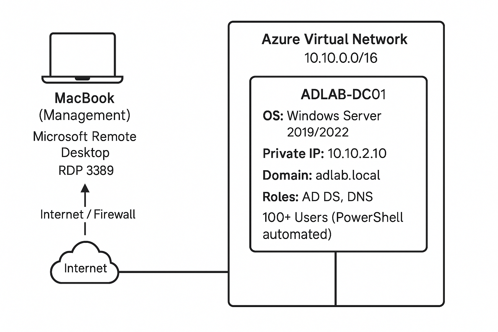
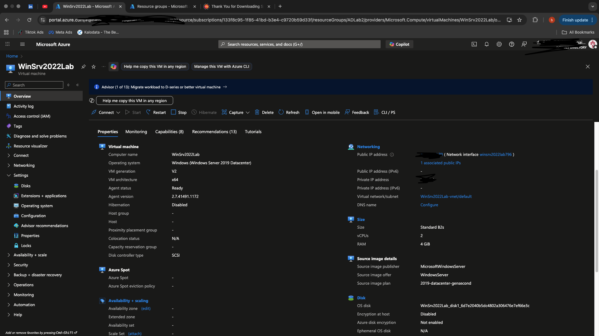
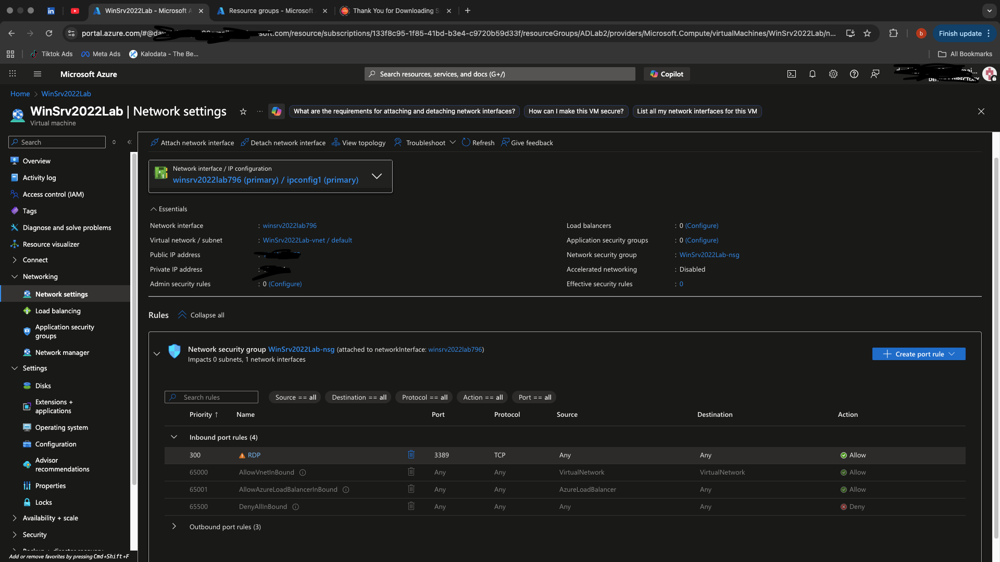
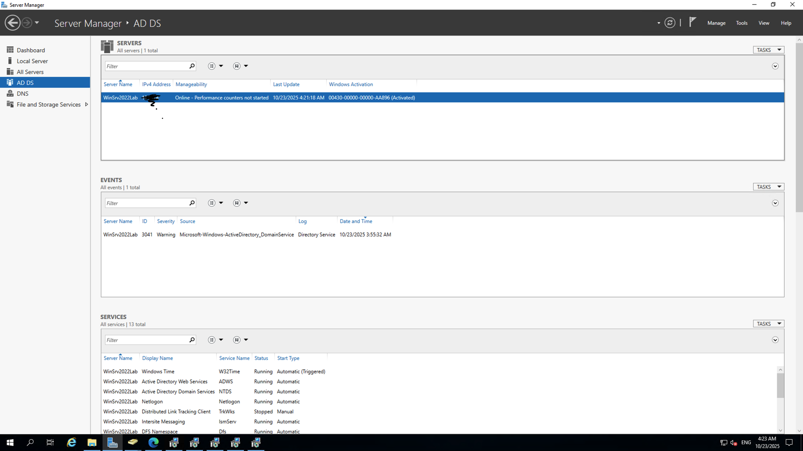
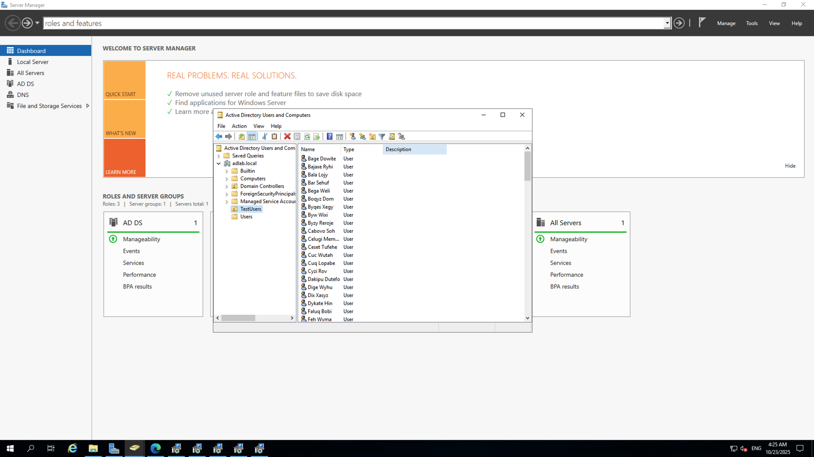
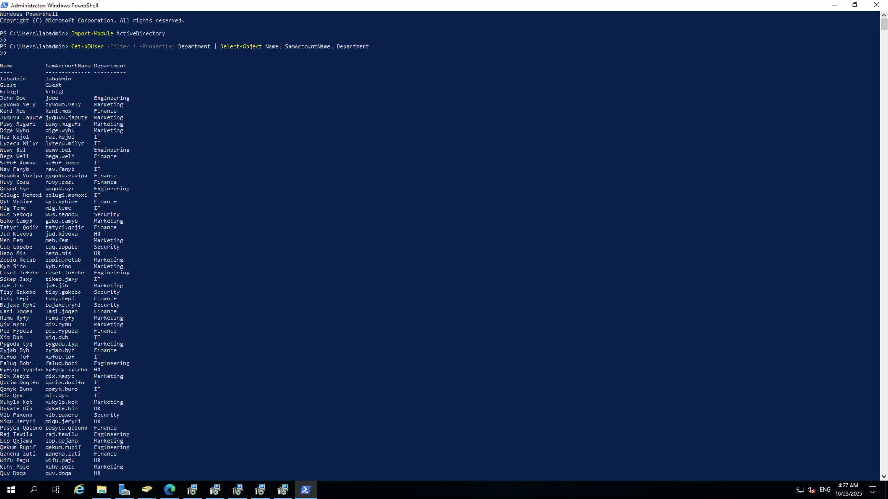

# 🧩 Active Directory Homelab – Azure + Windows Server (Built from macOS)

## 📘 Overview
This project demonstrates how I built and automated a **fully functional Active Directory environment** using **Microsoft Azure**, **Windows Server 2019/2022**, and **PowerShell**, all managed from my **MacBook via Microsoft Remote Desktop (RDP)**.

The goal was to simulate an enterprise-grade identity and access management (IAM) environment — complete with domain setup, DNS, organizational units, and over **100 users generated automatically** via PowerShell scripting.

---

## 🧠 Objectives
- Deploy a **Windows Server Domain Controller** on Azure (`adlab.local`).
- Configure **Active Directory Domain Services (AD DS)** and **DNS** roles.
- Create **Organizational Units (OUs)** for Users, Groups, and Computers.
- Automate creation of **100+ domain users** across multiple departments using PowerShell.
- Access and manage the server from **macOS (RDP)** for cross-platform workflow experience.

---

## ☁️ Architecture

**Architecture Summary**
- **Platform:** Microsoft Azure  
- **Management Device:** macOS (Microsoft Remote Desktop App)  
- **Domain:** `adlab.local`  
- **VM:** `ADLAB-DC01` (Windows Server 2019/2022)  
- **Roles:** Active Directory Domain Services (AD DS) + DNS  
- **Private IP:** `10.10.2.10`  
- **VNet:** `adlab-vnet (10.10.0.0/16)`  
- **Subnet:** `adlab-subnet (10.10.2.0/24)`  
- **OUs:** `Users`, `Groups`, `Computers`, `TestUsers`

**Networking & Access**
| Port | Protocol | Purpose |
|------|-----------|----------|
| 3389 | TCP | RDP access from macOS to Azure VM |
| 53 | TCP/UDP | DNS queries within VNet |
| *All others* | — | Denied by NSG default rules |

---

## 🧱 Azure Deployment

Deployed a Windows Server 2019 Datacenter VM through Azure Portal with:
- Region: **US East**
- Size: **Standard B2s**
- Authentication: **labadmin (local admin)**
- Inbound Ports: **RDP (3389)**
- Connected to **adlab-vnet**

---

## 🌐 Network Configuration

Configured **Network Security Group (NSG)** to:
- Allow inbound RDP (TCP 3389) from specific IPs.
- Allow DNS (TCP/UDP 53) inside the virtual network.
- Deny all other inbound traffic by default.

---

## ⚙️ Server Configuration

Using **Server Manager**, installed:
- **Active Directory Domain Services (AD DS)**
- **DNS Server**
- Promoted the VM to a **Domain Controller** for `adlab.local`.

---

## 🧩 Active Directory Setup

Created the following **Organizational Units** in ADUC:
- `Users`
- `Groups`
- `Computers`
- `TestUsers`

These OUs simulate real enterprise structure for account and access separation.

---

## 💻 PowerShell Automation

Used PowerShell to automate the creation of **100+ users** across departments.

